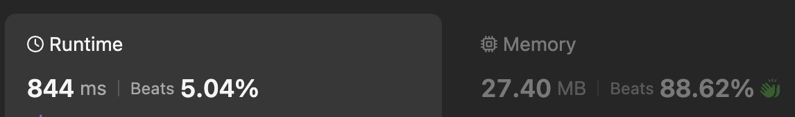
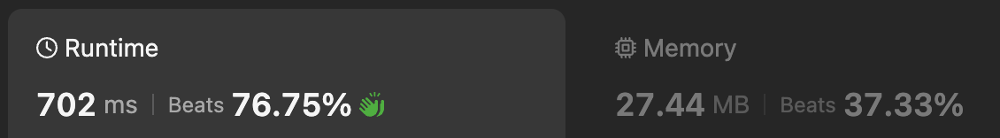

## [121. Best Time to Buy and Sell Stcok](https://leetcode.com/problems/best-time-to-buy-and-sell-stock/description/)

### 요구사항
- 주어진 배열 prices에서 주식을 사고 팔 때 최고의 이익을 구하여라.
    - 주식을 사는 날과 파는 날은 동일할 수 없으며, 반드시 다른 날에 이루어져야 한다.
    - 파는 날이 사는 날보다 앞에 올 수 없다.
- 어떠한 이익도 발생하지 않는다면 0을 반환한다.
### 제약 조건
```text
1 <= prices.length <= 10^5
0 <= prices[i] <= 10^4
```
2번 제약 조건으로 인해 Brute Force로 해결 하는 경우 시간복잡도는 10^8이다.   
→ 시간 초과가 발생할 수 있는 수준입니다. 따라서 Brute Force 접근법은 비효율적이다.

### 풀이 방법
- 해당 문제는 Kadane 알고리즘을 사용하여 해결할 수 있다.
- 매일 주식을 팔 때의 최대 이익을 구하기 위해 과거의 최소 주식 가격을 이용하여 현재 가격과의 차이를 최대화하는 방식으로 전환하여 생각   
→ 매일 주식을 팔고, 이 때 부분 배열의 합 중 최댓값을 구하는 방식으로 처리
---
## 내가 작성한 카데인 vs 타인이 작성한 카데인
### [카데인을 사용한 알고리즘 - 타인](https://leetcode.com/problems/best-time-to-buy-and-sell-stock/solutions/4868897/most-optimized-kadane-s-algorithm-java-c-python-rust-javascript/)
```python
def maxProfit(prices):
    buy = prices[0]
    profit = 0
    for i in range(1, len(prices)):
        if prices[i] < buy:
            buy = prices[i]
        elif prices[i] - buy > profit:
            profit = prices[i] - buy
    return profit
```
### 카데인을 사용한 알고리즘 - 내 풀이
```python
def maxProfit(prices: list[int]) -> int:
    if len(prices) == 1:
        return 0
    
    max_profit = current_profit = 0
    for i in range(1, len(prices)):
        current_profit = max(0, current_profit + prices[i] - prices[i-1])
        max_profit = max(current_profit, max_profit)
    
    return max_profit
    
print(maxProfit([7,1,5,3,6,4]))
```
### 차이점
- 두 코드는 성능상 차이가 많이 발생함.
- 내가 작성한 코드의 실행 시간
 
- 타인이 작성한 코드의 실행 시간

#### 어떠한 부분에서 차이가 발생할까?
##### 접근 방식
- 타인이 작성한 코드는 최대 하위 배열 합을 직접 구하는 대신 배열의 연속된 요소(가격) 간의 최대 양수 차이를 구하는 데 중점을 둔다.
- 타인이 작성한 코드는 더 낮은 가격이 발견되면 매수를 업데이트하고 현재 가격과 매수 사이의 차이를 잠재 수익으로 처리한다.
- 현재 가격과 매수 사이의 양수 차이가 현재 수익을 초과할 때마다 수익을 비교하고 업데이트한다.
##### 계산 방식
- max()의 호출   
    - 내가 작성한 코드의 경우 매 계산 마다 max()를 호출하여 값을 비교하고, 갱신을 수행한다.   
    → 타인이 작성한 코드에 비해 불필요한 연산(최대값 비교 및 갱신) 수행
    - 타인이 작성한 코드는 최저가, 최대 이익인 경우에만 갱신을 수행한다.   
    → 필요한 시점에만 조건문을 평가하여 불필요한 연산을 수행하지 않는다.
- 불필요한 사칙 연산
    - 타인이 작성한 코드의 경우에는 빼기 연산과 할당이 조건문을 수행한 이후에 진행된다.
    - 내가 작성한 코드의 경우에는 빼기 연산과 할당이 max()를 호출할 때마다 수행이 되기 때문에 불필요한 연산이 수행된다고 볼 수 있다.
### 타인의 코드 분석
- 카데인 알고리즘의 변형
- 항상 합을 구하지 않아도 최대 이익을 구할 수 있는 이유
    - 최소 구매 가격 추적
        - buy 변수는 항상 지금까지 본 가격 중 최소값을 유지한다.  
        → 잠재적인 최적의 구매 시점을 암묵적으로 추적하는 것과 같다.
    - 최대 이익 갱신
        - 각 단계에서 현재 가격과 buy 차이를 계산한다.   
        → 잠재적인 최적의 판매 시점을 암묵적으로 고려하는 것이다.
    - 그리디 접근
        - 각 단계에서 지금까지의 최소 가격과 현재 가격만을 고려한다.   
        → 과거의 모든 가격 조합을 명시적으로 비교할 필요 없이 최적의 결과를 얻을 수 있게 한다.
    - 단일 패스
        - 배열을 한 번만 순회하면서 최소 가격과 최대 이익을 동시에 갱신   
        → 실제 구매와 판매 날짜를 기록하지 않아도 최대 이익을 정확히 계산할 수 있다.
- 실제 구매와 판매 날짜를 추적하지 않아도, 최소 구매 가격과 그 이후의 최대 판매 가격의 차이를 정확히 계산할 수 있어 최대 이익을 효율적으로 찾을 수 있다.