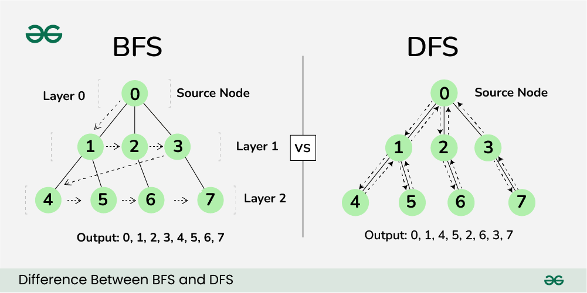

BFS(너비 우선 탐색)와 DFS(깊이 우선 탐색)는 그래프나 트리 구조를 탐색하는 알고리즘
## 시간 복잡도
V : 정점(Vertex)의 수   
E : 간선(Edge)의 수
1. 인접 리스트를 사용한 경우:
   - DFS: O(V + E)
   - BFS: O(V + E)

2. 인접 행렬을 사용한 경우:
   - DFS: O(V^2)
   - BFS: O(V^2)


## BFS (Breadth-First Search, 너비 우선 탐색)
### 정의
- 그래프의 가로 방향으로 탐색을 진행하는 알고리즘

### 특징
- 시작 노드에서 가까운 노드부터 차례대로 탐색
- 큐(Queue)를 사용하여 구현
- 최단 경로 문제를 해결하는 데 적합
  - 가중치가 없는 그래프에서만 최단 경로를 보장
  - 가중치가 있는 그래프에서 최단 경로를 보장
    - Dijkstra : 양의 가중치만 있을 때 보장
    - Bellman Ford : 음의 가중치도 포함한 가중치 처리 가능

### 동작 과정
1. 시작 노드를 큐에 넣고 방문 처리
2. 큐에서 노드를 꺼내 해당 노드의 인접 노드 중 방문하지 않은 노드를 모두 큐에 넣고 방문 처리
3. 큐가 빌 때까지 2번 과정을 반복

### 구현 코드
#### 인접 리스트(O(V + E))
```python
from collections import dequeue

# 인접 리스트 방식의 그래프
graph_adj_list = {
    'A': ['B', 'C'],
    'B': ['A', 'D', 'E'],
    'C': ['A', 'F'],
    'D': ['B'],
    'E': ['B', 'F'],
    'F': ['C', 'E']
}


def bfs(graph, start):
    # 단순 BFS에서는 노드의 첫 방문만을 고려하므로 set()으로 충분
    # 모든 간선을 고려해야 하는 경우, 간선 자체를 추적하는 방법을 사용
    # Dijkstra를 사용해서 처리하는 방법도 있음.
    visited = set()
    queue = dequeue([start])
    visited.add(start)
    result = []

    while queue:
        vertex = queue.popleft()
        result.append(vertex)
        for neighbour in graph[vertex]:
            if neighbour not in visited:
                visited.add(neighbour)
                queue.append(neighbour)
    return result
```

#### 인접 행렬(O(V^2))
```python
import numpy as np
from collections import dequeue

# 인접 행렬 방식의 그래프
adj_matrix = np.array([
    [0, 1, 1, 0, 0, 0],  # A
    [1, 0, 0, 1, 1, 0],  # B
    [1, 0, 0, 0, 0, 1],  # C
    [0, 1, 0, 0, 0, 0],  # D
    [0, 1, 0, 0, 0, 1],  # E
    [0, 0, 1, 0, 1, 0]   # F
])

nodes = ['A', 'B', 'C', 'D', 'E', 'F']

def bfs(adj_matrix, start_index):
    visited = set()
    queue = deque([start_index])
    visited.add(start_index)
    result = []

    while queue:
        vertex_index = queue.popleft()
        result.append(nodes[vertex_index])
        for i in range(len(adj_matrix)):
            if adj_matrix[vertex_index][i] == 1 and i not in visited:
                visited.add(i)
                queue.append(i)
    return result
```

#### `visited = set()`
- 이진트리에서는 필요하지 않다.
  - 이진 트리는 사이클이 없는 구조
  - 각 노드는 오직 하나의 부모 노드만을 갖는다.
  - 탐색 중에 각 노드는 정확히 한 번만 방문된다.
  - 리프 노드에 도달하면 해당 경로의 탐색이 종료된다.
  - 이로 인해 visited가 필요하지 않다.
- 필요한 경우
  - 그래프 탐색
  - 특정 조건 검사
  - DP

## DFS (Depth-First Search, 깊이 우선 탐색)
### 정의
- 그래프의 세로 방향으로 깊게 탐색을 진행하는 알고리즘

### 특징
- 한 경로를 끝까지 탐색한 후 다음 경로로 넘어간다.
- 스택(Stack) 또는 재귀 함수를 사용하여 구현
- 모든 노드를 방문하고자 할 때 주로 사용

### 동작 과정
1. 시작 노드를 스택에 넣고 방문 처리
2. 스택의 최상단 노드에 방문하지 않은 인접 노드가 있으면 그 노드를 스택에 넣고 방문 처리
   - 방문하지 않은 인접 노드가 없으면 스택에서 최상단 노드를 꺼낸다.
3. 스택이 빌 때까지 2번 과정을 반복

### 순회 방식
#### Pre-order
- Root -> Left -> Right
- 루트를 먼저 방문하므로 트리의 구조를 빠르게 파악할 수 있다.
- 트리를 복사하거나 전위 표기법을 구현할 때 유용
- 동작 방식
  1. 현재 노드를 방문하고 처리
  2. 왼쪽 서브트리로 재귀 호출
  3. 오른쪽 서브트리로 재귀 호출

#### In-order
- Left -> Root -> Right
- 이진 탐색 트리에서 오름차순으로 노드를 방문
- 대칭적인 순회 방식
- 트리의 대칭성을 확인할 때 유용
- 동작 방식
  1. 왼쪽 서브트리로 재귀 호출
  2. 현재 노드를 방문하고 처리
  3. 오른쪽 서브트리로 재귀 호출

#### Post-order
- Left -> Right -> Root
- 자식 노드부터 처리하므로 트리의 삭제 작업 등에 유용
- 후위 표기법 수식을 계산할 때 사용
- 동작 방식
  1. 왼쪽 서브트리로 재귀 호출
  2. 오른쪽 서브트리로 재귀 호출
  3. 현재 노드를 방문하고 처리

### 구현 코드
#### 인접 리스트(O(V + E))
```python
# 인접 리스트 방식의 그래프
graph_adj_list = {
    'A': ['B', 'C'],
    'B': ['A', 'D', 'E'],
    'C': ['A', 'F'],
    'D': ['B'],
    'E': ['B', 'F'],
    'F': ['C', 'E']
}


def dfs(graph, start, visited=None):
    if visited is None:
        visited = set()
    visited.add(start)
    result = [start]

    for neighbour in graph[start]:
        if neighbour not in visited:
            result.extend(dfs(graph, neighbour, visited))
    return result
```

#### 인접 행렬(O(V^2))
```python
import numpy as np
from collections import dequeue

# 인접 행렬 방식의 그래프
adj_matrix = np.array([
    [0, 1, 1, 0, 0, 0],  # A
    [1, 0, 0, 1, 1, 0],  # B
    [1, 0, 0, 0, 0, 1],  # C
    [0, 1, 0, 0, 0, 0],  # D
    [0, 1, 0, 0, 0, 1],  # E
    [0, 0, 1, 0, 1, 0]   # F
])

nodes = ['A', 'B', 'C', 'D', 'E', 'F']

def dfs(adj_matrix, start-index, visited=None):
    if visited is None:
        visited = set()
    visited.add(start_index)
    result = [nodes[start_index]]

    for i in range(len(adj_matrix)):
        if adj_matrix[start_index][i] == 1 and i not in visited:
            result.extend(dfs(adj_matrix, i, visited))
    return result
```

## BFS와 DFS 비교

| 특성 | BFS | DFS |
|------|-----|-----|
| 탐색 방식 | 너비 우선 | 깊이 우선 |
| 구현 방법 | Queue | Stack |
| 접근 방식 | 횡단적 접근 방식(FIFO) | 종단적 접근 방식(LIFO) |
| 사용처 | 이분 그래프, 최단 경로 | 비순환 그래프, 강하게 연결된 구성 요소 찾기, 모든 경로 탐색 |


- 시간 복잡도 자체는 같지만, 실제 수행 시 약간의 차이가 있을 수 있다.

1. 메모리 사용:
   - DFS는 재귀 호출 또는 스택을 사용하므로 최악의 경우 O(V) 공간을 사용
   - BFS는 큐를 사용하여 O(V) 공간을 사용

2. 탐색 순서:
   - DFS는 그래프의 깊은 부분을 우선적으로 탐색
   - BFS는 그래프의 넓은 부분을 우선적으로 탐색

3. 최단 경로:
   - BFS는 가중치 없는 그래프에서 최단 경로를 찾는 데 유용
   - DFS는 최단 경로를 보장하지 않는다.

4. 구현 복잡도:
   - DFS는 재귀를 사용하여 비교적 간단하게 구현할 수 있다.
   - BFS는 큐를 사용하여 구현하므로 DFS보다 약간 더 복잡할 수 있다.

5. 시간 복잡도 :
   - DFS와 BFS의 시간 복잡도는 일반적으로 동일
   - 그래프의 표현 방식에 따라 시간 복잡도가 달라질 수 있지만, DFS와 BFS 자체의 알고리즘으로 인한 시간 복잡도 차이는 없다.